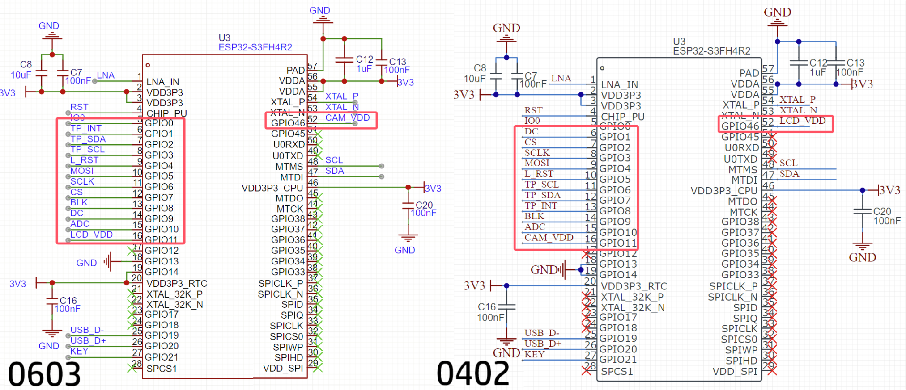

# ESP32S3_Touchscreen_Thermal

为 [启凡科创 QF-HEYE 热成像仪](https://oshwhub.com/dhx233/gai-ban-re-cheng-xiang) 提供开源的软件实现

原项目基于 0402 主板，与 0603 主板有部分差别 (详见下图) 导致无法使用。本项目适配 0603 主板，并修复一些错误 (详见 Commit diff)

关于更多未提及的部分 (从源代码构建、使用)，烦请移步 [原项目](https://github.com/umeiko/esp32s3-mlx90640-touchscreen-arduino)

---

## Credits

[umeiko/esp32s3-mlx90640-touchscreen-arduino](https://github.com/umeiko/esp32s3-mlx90640-touchscreen-arduino)

[mike-rankin/ESP32-S3_MLX90640_Thermal](https://github.com/mike-rankin/ESP32-S3_MLX90640_Thermal)